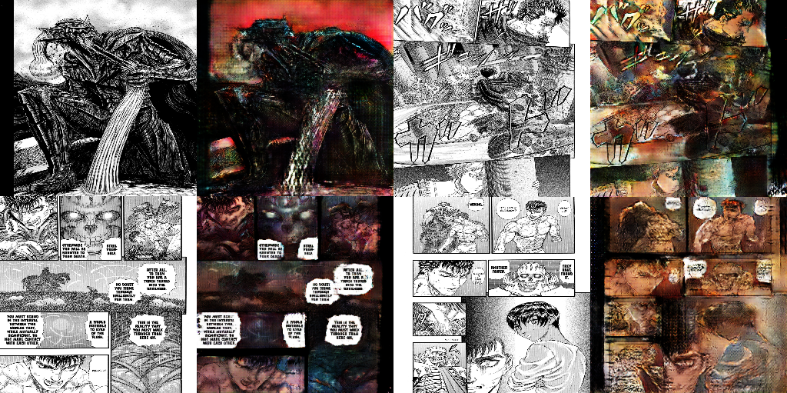

# BerserkMangaColoring

In this project, I attempt to solve the problem of adding color to greyscale pages from a [manga](https://en.wikipedia.org/wiki/Manga) using convolutional neural networks. Color can often bring more life to the original greyscale art. However, actually coloring a page from a manga can take hours or days to finish. It would be nice to be able to automate this process. 

This problem is not new; a few groups have attempted a similar problem before with different datasets and methods (in particular, see [here](http://kvfrans.com/coloring-and-shading-line-art-automatically-through-conditional-gans/) and [here](https://github.com/OValery16/Manga-colorization---cycle-gan)). I've chosen to apply this to the manga [Berserk](https://en.wikipedia.org/wiki/Berserk_%28manga%29) simply because it is my favorite and hence I hold value in the desired result. Also, I intend to learn how to use the PyTorch library by working through this problem.

Currently, I've tried three different neural network architechtures:

1. A custom CycleGAN network,
2. [The official pix2pix network](https://github.com/junyanz/pytorch-CycleGAN-and-pix2pix),
3. [The official pix2pixHD network](https://github.com/NVIDIA/pix2pixHD).

I will describe these three architechtures later, focusing on the first one. Each of these three have their own folder in the repository. 

The networks were each trained over Google Colab in conjuction with Google Drive. The notebooks in this repository will reflect this fact, since I must mount the drive and use paths relative to my own drive. Anyone else attempting to run these notebooks will need to update these code blocks to their specific situation (as well as include their own data since I removed the datasets, which I explain the reasoning for below). I might suggest to try and build your own notebook instead of explicitly using mine. 
## Data

First let me describe the data. Since the data are images which are copywritten by the artists, I will not share more than I need to get the ideas across. You can buy the original English translated copies at [Dark Hose Comics](https://digital.darkhorse.com/pages/156/berserk) and the deluxe versions on [Amazon](https://www.amazon.com/s?k=berserk+manga&ref=nb_sb_noss_2). The colored images used for training were found on the [Berserk](https://www.reddit.com/r/Berserk/) and [Guild Of The Falcon](https://www.reddit.com/r/GuildOfTheFalcon/) subreddit pages. These artists spend a lot more time crafting the art (ground truths)  and are better than any neural network, so I suggest you look there first.

There are two datasets of raw images, one which contains greyscale images (BW), and another which contains colored images (RGB). The BW images were originally greyscale (1 channel), but I converted them to RGB (3 channels) by making 3 copies of iteslf and concatenating those. This way, the data in both datasets will be the same size (after resizing). Both datasets have a size of 628, and so they are fairly small, which will become a problem later. 

The RGB images are a mix of [panels](https://en.wikipedia.org/wiki/Panel_%28comics%29), full pages, and two-page spreads. The greyscale images do not contain panels, only full pages and two-page spreads. Furthermore, for each of the 259 RGB images which are not panels, there is a unique corresponding greyscale image which is the page from which the RGB image was colored from. In other words, the data is partially-labeled. I found these black & and produced these labels by hand, which was time consuming. The reason I only labeled the non-panel RGB images was because the corresponding greyscale images would be too time consuming for me to produce by hand, as they would need to be cropped very precisely. I should note that it is possible to train an image-segmentation algorithm to segment panels from full pages (see [this paper](https://arxiv.org/pdf/1706.06759.pdf) for details), but I assume that I would have to perform detail cropping and resizing to the results either way. 

## Cycle-GAN

CycleGANs are a popular choice of architecture for style-transfer problems between unlabeled data. One serious problem facing orginary GANs is the issue of mode collapse. This is when the GAN learns to produce the same image over and over. The idea behind CycleGANs is that there are two GANs pointing opposite directions between the two datasets. The loss function includes the usual adversarial loss from the discriminators in addition to (literally) cycle loss and identity loss. 

Cycle loss is the L1-norm between the original image and the image after passing through the composite of both generators. This type of loss measures how close the generators are to being inverse functions. This loss prevents mode collapse in the following sense: if a function is invertible (or "close to" it) then the function must be one-to-one. A generator which has learned mode collapse is constant, and hence not one-to-one. 

Identity loss is the L1-norm between the original image and the image after passing through the *unintended* generator. For example, if we feed an RGB image through the generator which colorizes BW images, then we would want the result to do nothing to the already-colored original RGB image. Identity loss is necessary; I tried without identity loss first, and the colorizing generator was producing inverted colors. This is because cycle loss doesn't penalize the scenario where a given pixel goes through the cycle as approximately white -> black -> white, or black -> white -> black. Identity loss is one way to penalize this learned behavior. 

The generators follow a U-net architecture, with the modification that there's only one skip connection in the forward method. The forward method works as follows:

1. Downsample the image using a sequence of convolutional filters with leaky ReLU activation functions.
2. Save a copy of the result for a skip connection.
3. Pass the result of 1. through a sequence of basic residual blocks with leaky ReLU activation functions.
4. Add the copy from 2. to the result from 3. 
5. Upsample the result using a sequence of transposed convolutional filters with leaky ReLU activation functions.
6. Output the entry-wise hyperbolic tangent of the result, which is of the same size as the input (it's an image).

The discriminators are simplly a sequence of downsampling via convolutional filters with leaky ReLU activations. The number of output neurons match the size of the mini-batches. Each neuron represents how sure the discriminator believes the input to be real or fake.

One major downside to CycleGANs is that they consist of two separate GANs, which means twice the number of trainable parameters. This will prove to be an issue (for me), as we will see later.

### Data Prep

The images were resized to 256x256 pixels and split into training and testing sets. 

Since the training datasets are so small, the data was augmented. The images were passed through PyTorch dataloaders using a few different transformations subject to a probability of firing (in the following order):

* 50% chance to change color saturation to a random value,
* 20% chance to rotate the image by a random number of degrees between 10 and 30,
* 40% chance to flip the image horizontally,
* 20% chance to flip the image vertically,
* 100% chance to apply a random resize and crop operation to the image,
* 100% chance to resize the image to 256x256 pixels.

I chose not to alter the hue of the images, in hopes that the network will learn the color of the specific characters. 

### Results + Further Comments

Due to the nature of the data and the task (we are coloring images), we can get a pretty good idea for how the network is performing simply by taking a look at the results. 

At the very least, the network can recognize that the output must look similar to the input. But the images are not really being colored in an intelligent way. The network is unable to recognize different objects and color them differently. Rather, it seems that they are all being shaded the same tint of red (there is a lot of red used in the images used for training). There are many different things that could be going wrong, but I have a couple ideas for what they are:

1. We are dealing with less than 1000 unpaired images, which may be too small for the network to learn the correct style. This problem is hard to fix since we've already used data augmentation. We either need to gather more data, or use our limited data more effectively. 
    * Gathering more data would mean using images from other mangas since I've already included all of the colored Berserk images I could find. This might work if we find another manga which shares a similar art style to Berserk (perhaps Vinland Saga is a good contender), but I worry that this would encourage the network to learn how to color characters from Berserk in a way which isn't true to the original intended colors. 
    * On the other hand, we may be able to use our data more effectively with another network architecture. In particular, the CycleGAN is not taking advantage of the fact that some of our data is actually paired. This is actually a big deal, and we should use this, as we do when we switch to pix2pix. 
2. We do not have the computing power to create a CycleGAN with an acceptable number of trainable parameters. Since a CycleGAN is two GANs wired together, that means that each separate GAN must be roughly half as powerful. This is a hard wall issue attached to the CycleGAN architecture.
    * Even using Google Colab Pro, I wasn't able to make my batch size bigger than 8 and the number of trainable parameters bigger than ~5 million. Any larger, and CUDA would throw an Out Of Memory error during the first epoch. This suggests that we might want to change our network to something fundamentally different. 

## pix2pix

The pix2pix algorithm uses a Conditional-GAN network architecture, which you can read about [here](https://arxiv.org/abs/1611.07004), but I will summarize/simplify some of the important parts. 

The generator is an honest U-Net, which is similar to the generators in the last section, except with multiple skip connections. The discriminator is what the authors call a Markovian discriminator, which is built by convolutionally applying a smaller discriminator to all of the NxN square pixel patches of the input image, and taking the mean of the result.

The loss function is given by constructed by taking the sum of the adversarial-loss with L2-loss. The authors claim that the L2-loss encourages the model to learn the coarser details, while the adversarial loss from the Markovian discriminator encourages the model to learn the finer details.

### Data Prep

The data prep here is a sequence of a few tasks. 

Firstly, the RGB and BW images had to be extracted from the original, unpaired datasets. This is easy because of the naming convention I chose for the filenames, which was "[chapter]_[page].png". In particular, any paired images will have the same filename. Therefore, I could easily write a script which extracts the paired data into different folders, simply by copying the files if a given image has a pair. 

Next, the pix2pix algorithm demands that the images are 256x256 in resolution. We had already resized the images to this size for the custom CycleGAN, so we don't need to do anything here.

Finally, the input to the algorithm is actually a 512x256 image which is a BW-RGB pair concatenated horizontally. This can be done a few different ways, but perhaps the easiest way is to use the `hconcat` function from the OpenCV library. 

### Results + Further Comments
Again, we will simply analyze the results by inspection. 

These results definitely show an improvement from the results of the custom CycleGAN. The model is able to detect multiple objects in a single image and color them separately. I assume this is due to a mix of two reasons:

1. Using a lesser amount of paired data is more powerful than using a slightly larger amount of unpaired data.
2. The code given by the authors of the original pix2pix algorithm is more sophisticated than my custom CycleGAN, providing better optimizations.

Still, the result is not desireable. The coloring is not all contained in the lines. Also, the colors are not always correct, especially for objects which aren't recurring characters. In all cases, the synthesized images look very different from the real colored images. 

That said, we should not take the comparison of the generator-colored images against the artist-colored images too literally. Very often do the artists take creative liberties which we should probably not expect a generator to be able to learn. 

One possible problem is that too much information is lost when the images are resized to 256x256. Just by inspection of a resized BW image, we can see that the details are muddled and that it is harder to see what is actually going on in the image. This might explain why some images behave better than others while passing through the generator. For this reason, it's not inconcievable that a model that can hander images of a larger resolution would perform better. This is what we try next with pix2pixHD.

## pix2pixHD
The pix2pixHD algorithm is similar in spirit to the pix2pix algorithm, but has some significant differences. You can find the details in the original paper [here](https://arxiv.org/abs/1711.11585v1). I will summarize/simplify some of the important parts here.

The best feature of this algorithm is that we can train its network on images with resolution 1024x1024. This size is very close to the dimensions of the raw images, only requiring a small resize. One expected advantage here is that less data is lost during data prep due to the lesser amount of compression, compared to other attempted algorithms. One should know that the time it takes to train a pix2pixHD network is significantly longer than a pix2pix network. 

The generator is what they call Course-to-Fine generator. The forward method is a downsampling operation, followed the same generator from pix2pix summed with a connection skipped over this generator, followed by an upsampling operation. In this way, the generator is essentially a U-net with an extra skip connection which inputs and outputs bigger images thanb pix2pix. One subtle point is that the parameters for the pix2pix generator in the middle is trained separately and after the rest of the whole Course-to-Fine generator. This training step is followed by another, which is to train the network all together. The authors claim that this method of training will enforce the network to learn global behavior from learned local behavior. This local-to-global idea is more necessary for images of bigger resolution, since "local" has more meaning for bigger images. 

The discriminator is an ensemble of discriminators of the same type as those from pix2pix, each of which has a kernel of a different size. In the paper they use three different discriminators, but the network seems to train better with only two. With different sized kernels, the discriminators will learn pattens of different sizes. Again, this is more necessary for larger images since there is a bigger range of sizes that patterns in the images can have.

### Data Prep

The data prep is simple. We've already created paired datasets during the pix2pix prep. For now, we simply need to resize the images to be 1024x1024. We don't even need to worry about horizontally concatenating the images like we did for pix2pix. 

### Results + Comments

Some results are below. As usual, we will judge the performance of the network by visual inspection. 

Some of the results looks very pretty good. However, many of the images have had their structure severely damaged in the coloring process, as we can see with the last two results. In these cases, the network learns this destructive behavior early on, and no amount of training leads to improvement. I haven't noticed any feature shared by the images which are destroyed which are not present in the images that are well-colored by the network. One possibility is that it isn't sure how to deal with images that contain objects without well-defined boundary lines. For example, grass and mountains often have a different style than the characters. 

It is interesting to see how the network handles text. Sometimes, the text is copied over prefectly. Other times, it is completely distorted. Also, we can see in the last image that it may try to color a speech bubble, even if the original image didn't have one. 

## Further Comments

It probably true that more data is needed to get this model to work properly. I believe this because of the success that other people have had performing similar tasks (manga colorization) using different, bigger datasets. The way I see it, there are three ways to get more data:

1. Wait until more artists make color more Berserk pages,
4. Try to pair more of the still-unpaired data that we have,
2. Use colored pages from different mangas or comics.
